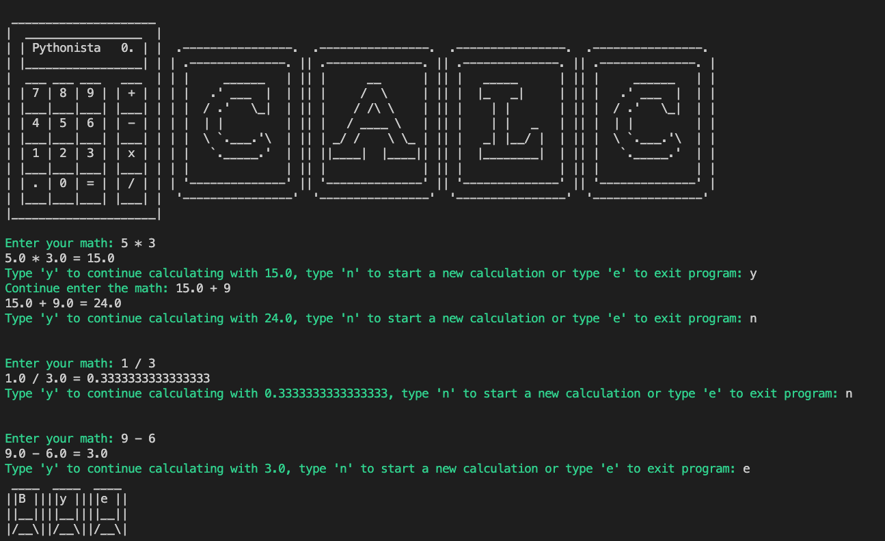

# Day-10 of 100.

## Calculator
[Original Requirement](https://replit.com/@appbrewery/calculator-final)

Intead of ask user to enter first number, second number and operation, just make their live easier by allow them enter only 1 input include 3 of them. For example: `3 + 5` or `2 * 10`.

Remember to validate user's input.

## Demo
