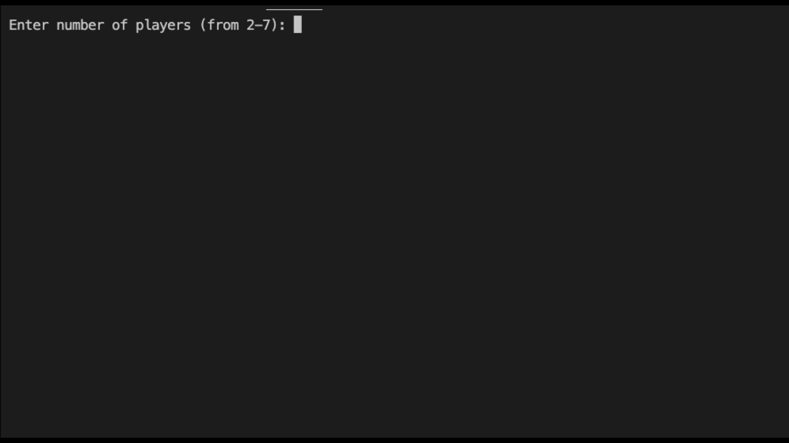

# Day-11 of 100.

## Blackjack

### Instruction
- Ask user for how many players.
- Assign each player same amount of chips
- Ask players for their bets
- Draw 2 cards for each player and 1 card for dealer
- Show player cards and dealer card, ask if they want to hit or stand
- Draw cards for dealer
- Compare points each player to dealer
- Pay chips for players if they win
- Ask them if they want to continues

### Demo

