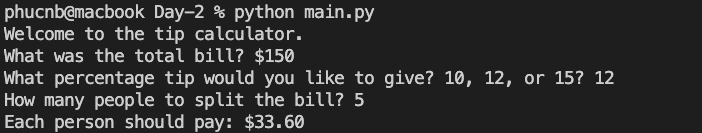

# Day-2 of 100.
## The Tip Calculator

The program helps you split tips with your friends.

### Input: total amount, tip percentage, number of people
### Output: The total of amount each person should pay

### Additional: 
- Re-prompt until user enters a valid input
- Round the final amount to 2 decimal places
- Users can change tip options later without edit string

### Demo:

### References:
- [inflect](https://pypi.org/project/inflect/#description)
