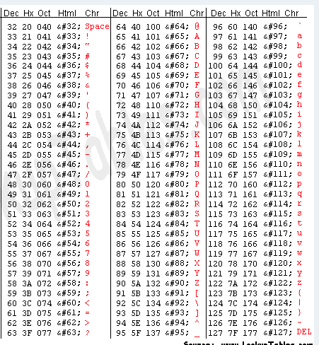

# Day-8 of 100.

## Advanced Vigenère Cipher
We know that with Caesar Encryption, every character in the string will be shifted by *n* element in the ASCII table. Therefore, it's not difficult to decryp the string by try with different *n*.
What if each letter in the string will be shifted by different *n* elements where *n* is the *value of n* in ASCII of a letter in the key.

For example:

Let's create a program, ask user for a `text` and a `key` then encrypt the `text`.
User also can decrypt the `cipher` by given a correct `key`.

### Note
- A normal Vigenère Cipher usually uses only alphabet letters including *upper case* and *lower case*. To increase the security, use all characters from ASCII table excep the first 32 characters and the last one (from 32 to 126 in the table).
- If the `key` is shorter than `text` than repeat the `key` until they both have same length.

## Instruction
