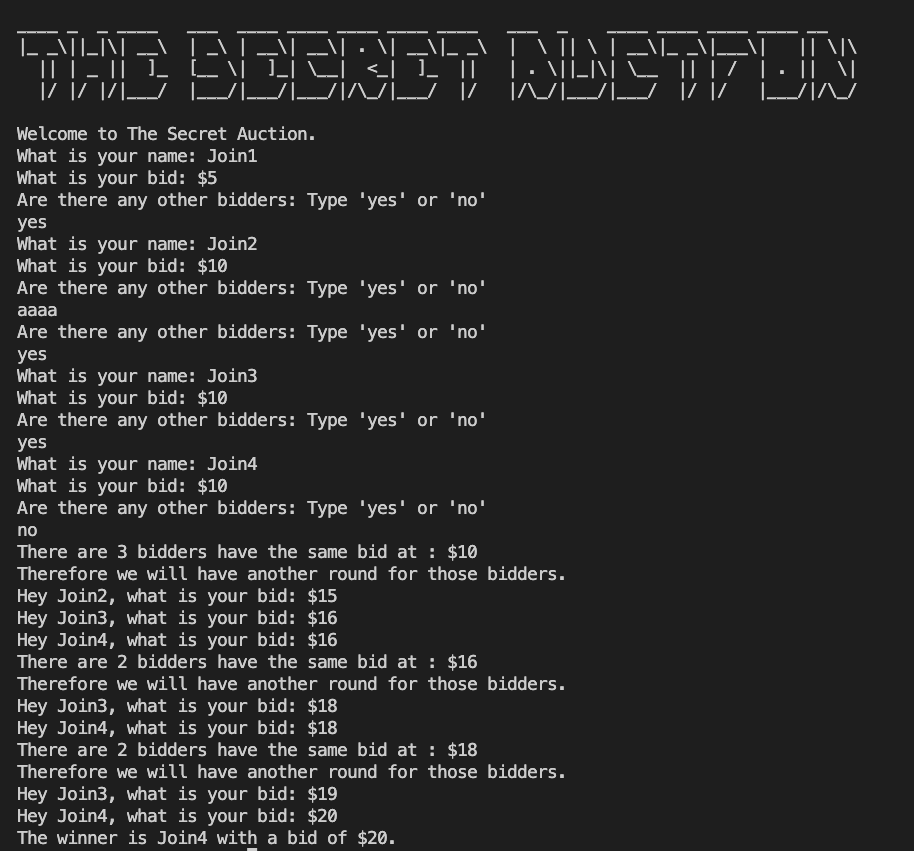

# Day-9 of 100.

## The Secret Auction

The program will ask for bidder's name and bid then print the highest bidder.
If there are 2 bidders bidded the same amount then they will have another round until find the winner.
We ignore the case bidders have same name because it is posible in the real word.

### Demo

